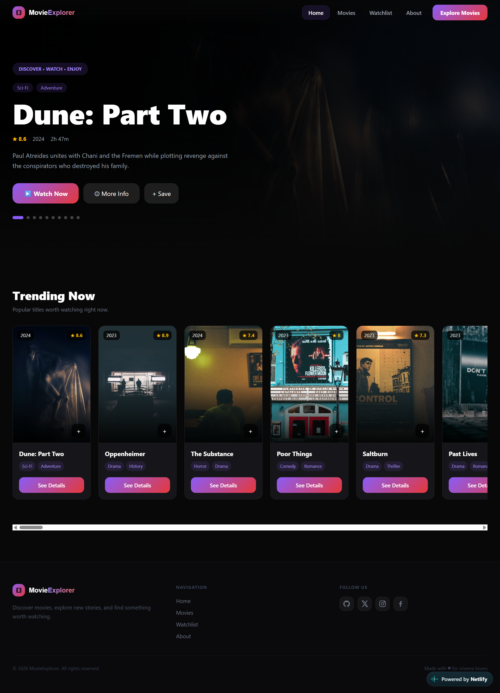

# 🎬 CineJourney

CineJourney is a modern movie discovery website where users can explore movies, view detailed information, and create their own watchlist.

## 🌐 Live Demo

Visit CineJourney : https://cine-journey.netlify.app/

## 📦 Repository

GitHub Repository : https://github.com/ridumondol/Movie-Explorer
## 📸 Project Screenshot



## ✨ Features

* 🎬 Browse and explore movies
* 🔎 View detailed movie information
* ❤️ Add and remove movies from your watchlist
* 📱 Responsive design for different screen sizes
* 🧭 Easy navigation between pages
* 🎥 Movie details with rating, genre, runtime, language, and overview

## 🛠️ Technologies Used

* React.js
* JavaScript (JSX)
* Vite
* HTML5
* CSS3
* React Icons

## 📂 Project Structure

```text
Movie-Explorer/
├── src/
│   ├── components/
│   ├── data/
│   ├── App.jsx
│   └── main.jsx
├── public/
├── index.html
├── package.json
├── vite.config.js
└── README.md
```

## 🚀 Getting Started

Clone the repository:

```bash
git clone https://github.com/ridumondol/Movie-Explorer.git
```

Go to the project folder:

```bash
cd Movie-Explorer
```

Install dependencies:

```bash
npm install
```

Start the development server:

```bash
npm run dev
```

Open the local URL shown in your terminal.

## 📸 Project Preview

CineJourney provides a clean and simple interface for discovering movies and managing a personal watchlist.

## 👨‍💻 Developer

**Md Ridoy Mondol**

Frontend Developer | React Learner

---

⭐ If you like this project, feel free to give it a star on GitHub!
